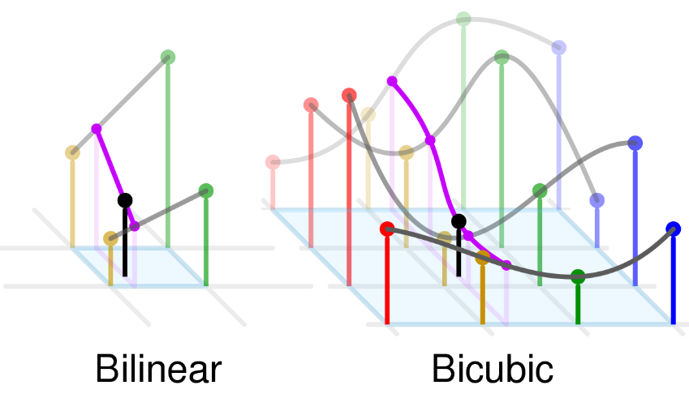

# README

# HW1 for image processing

## Requirements

1. Write a program for non-integer scaling of an image with two interpolation methods: – Bilinear interpolation – Bicubic interpolation
2. Take a selfie of yourself, and apply the above image scaling program on your selfie (or part of your selfie, e.g., your right eye) with the scaling factors of 0.2, 5, and 32.
3. Compare the quality of the images obtained with bilinear interpolation and with bicubic interpolation.
4. Explain the method of bicubic interpolation, and compare its computational complexity with that of bilinear interpolation.

## Report

For requirements 1 & 2, you need to show

- which function you use or implement
- how does your program work
- how to use your program

For requirements 3 & 4, you need to provide

- Resulted images for comparison
- Explanation

## requirement 1 & 2

### which function you use or implement

I use the function in OpenCV, which implement each algorithm can check this website:

[OpenCV: Geometric Image Transformations](https://docs.opencv.org/4.6.0/da/d54/group__imgproc__transform.html#ga47a974309e9102f5f08231edc7e7529d)

otherwise, we can confirm the algorithm meaning in this page:

[OpenCV: Geometric Image Transformations](https://docs.opencv.org/4.6.0/da/d54/group__imgproc__transform.html#ga5bb5a1fea74ea38e1a5445ca803ff121)

the another question for me is about the definition of “factor” ? Let we check the document in first website, it say

```
// If you want to decimate the image by factor of 2 in each direction, you can call the function this way:
// specify fx and fy and let the function compute the destination image size.
resize(src, dst, Size(), 0.5, 0.5, interpolation);
```

as above, we can inference 1/factor mean fx,fy in method in openCV

### how does your program work

use python script to resize local image by openCV function

### how to use your program

1. execute in python environment (suggest: >=3.8)
2. install package in requirement.txt
3. use `pip install opencv-python` in CLI to install opencv
4. use `bash generateImgs.sh` in CLI to generate image to ./output/ (the source image is selfie in folder)
5. can check “`generateImgs.sh`” to get the detail for script parameters

## requirement 3 & 4

### Resulted images for comparison

[output.zip](https://drive.google.com/file/d/15NGzyNMf_3kCZwDEGnA2_Gn8D92Cs-cZ/view?usp=sharing)

### Explanation(compare the quality of the images)

To compare the quality of the images obtained with bilinear interpolation and with bicubic interpolation, I found that “bicubic” increase the smoothness in picture, so “bicubic” images have less “artifacts” than “bilinear” images, just like the figure below.



tag: copy from [https://en.wikipedia.org/wiki/Bicubic_interpolation#/media/File:Comparison_of_1D_and_2D_interpolation.svg](https://en.wikipedia.org/wiki/Bicubic_interpolation#/media/File:Comparison_of_1D_and_2D_interpolation.svg)

### Explanation(Explain the method of bicubic interpolation, and compare its computational complexity with that of bilinear interpolation)

explain the method of bicubic interpolation below:

If the derivatives of the interpolation function are known, a common approach is to use the heights of four vertices and three derivatives for each vertex. The first derivatives h’x and h’y represent the surface slopes in the x and y directions, and the second mutual derivatives h’’xy represents the slope in both the x and y directions. These values can be obtained by successively differentiating the x and y vectors, respectively. For each vertex of the mesh element, bring the local coordinates (0,0), (1,0), (0,1) and (1,1) into the equation below and solve the 16 equations.

$\sum_{i=0}^3\sum_{i=0}^3\quad a_{ij}x^iy^j$

the bilinear interpolation only use general interpolation with 4 point, it do not need to care the derivatives of the interpolation function. Therefore, It only need to use 4 equations to solve the point.

Finally, i consider “bicubic” has more than 4 times complexity than “bilinear”. (suppose the derivatives of the interpolation function are known, or it need more complexity to solve the derivatives)
